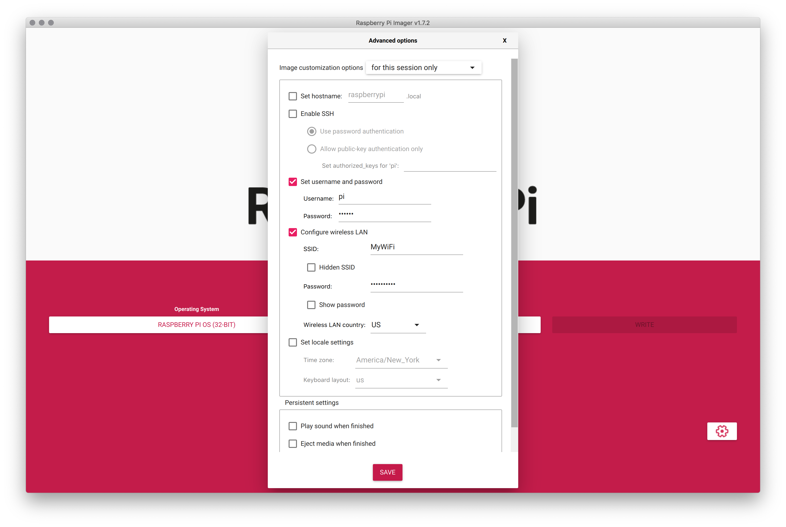

# Raspberry Pi Synchronized Video Playback

[Last Updated June 2022]

This guide covers the setup and use of multiple [Raspberry Pi 4 Model B](https://raspberrypi.org) computers for synchronized video playback across any number of projectors or screens.  

### How does this work?

This setup allows for any number of Raspberry Pi computers to start video playback simultaneously.  A separate server (which could be run on one of the Raspberry Pi's or on another computer) will tell the clients when to start playback. 
1. Clients will each run a [Node.js](https://nodejs.org/en/) script which repeatedly attempts to open a websocket connection (using the [socket.io](https://socket.io/) library) to a server.  
2. Once the server is launched, it will accept these incoming socket connections and send a 'stop' message to each of its clients.
3. Clients will stop any current video playback.
4. Server will launch a 'go' command to clients.
5. Clients will start video playback using the [ffplay](https://ffmpeg.org/ffplay.html) utility.

Notes:
* Raspberry Pi video playback is not the best...

## Setup 

### Install Raspberry PI OS onto SD Card
Using the [Raspberry Pi Imager](https://www.raspberrypi.com/software/) tool, install the Raspberry Pi OS 32-Bit (Debian Bullseye, released 2022-04-04) to your SD card.  Press the gear icon to set a login password and WiFi settings (SSID and Password).



### Minimal Interface
Insert the newly created Raspberry Pi Once booted into the Raspberry Pi using the SD card setup during the previous steps, ensure that we are using a minimal interface.

* Right click on Desktop, then click on Desktop Preferences
    * Set Layout to No image
    * Set Colour to black
    * Uncheck Wastebasket and External Disks to ensure they are not shown on Desktop
    * Click Ok

* Right click on Taskbar, then click on Task Bar (Window List) Settings…
    * Uncheck Flash when there is a window requiring attention

* Right click on Taskbar, then click on Panel Settings…
    * Under Notifications tab, uncheck Show notifications
    * Under Advanced tab > Automatic hiding group 
    * Check Minimize panel when not in use
    * Set Size when minimised to 0 pixels

At this point, you should see a black desktop with your mouse over it.  Never fear!  We will remove the mouse soon!


### Install Prerequisites


```
sudo apt update
sudo apt install nodejs npm unclutter
```

### Install RPI Media Player

```
git clone https://github.com/AidanNelson/rpi-media-player.git 
cd rpi-media-player/client
npm install
```

### Create Startup Script


```
sudo nano /etc/xdg/autostart/rpimediaplayer.desktop
```

Add the following:

```
[Desktop Entry]
Name=SyncVideoClient
Exec=/usr/bin/npm run --prefix /home/pi/rpi-media-player/client start   
```

Save this (control-x) then press enter


### Remove Splash Screen
https://scribles.net/customizing-boot-up-screen-on-raspberry-pi/


### Set Static IP on eth0

* Right click on the network icon in the taskbar, click into "Wireless & Wired Network Settings..." set up eth0 interface to have IP of 192.168.1.X and router at 192.168.1.1.  Uncheck autofill rest of parameters and check disable ipv6


sudo nano /boot/cmdline.txt
Then, replace “console=tty1” with “console=tty3”. This redirects boot messages to tty3.
 

Remove other things
Still in “/boot/cmdline.txt”, add below at the end of the line

splash quiet plymouth.ignore-serial-consoles logo.nologo vt.global_cursor_default=0